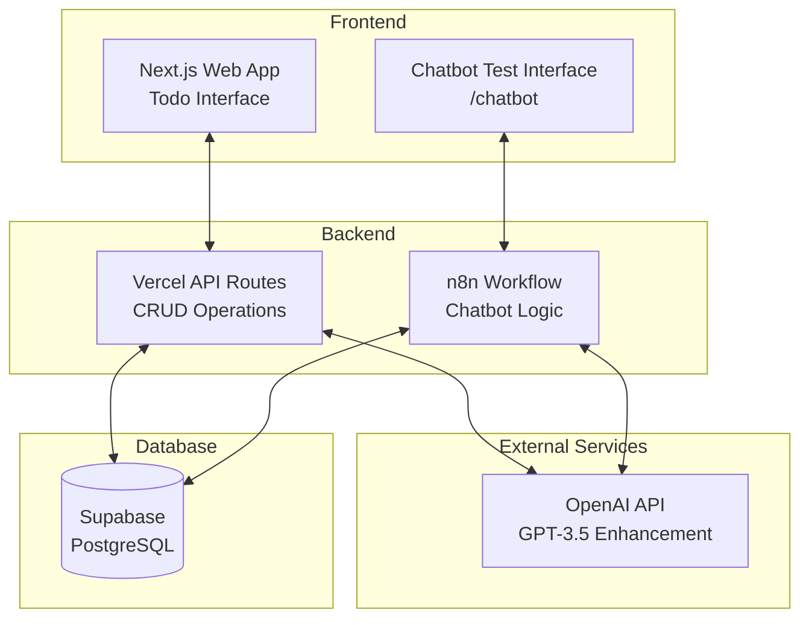

# 🚀 AI-Enhanced Todo List - Full Stack Solution

A modern todo list application with AI enhancement capabilities, featuring a Next.js web interface and integrated chatbot testing interface.


## 📋 Project Deliverables

| Requirement | Status | Implementation |
|------------|--------|---------------|
| **Part 1: Web Interface** | ✅ Complete | Next.js app with full CRUD operations |
| **Part 2: Chatbot Interface** | ✅ Complete | n8n workflow + web test interface |
| **AI Enhancement** | ✅ Complete | OpenAI GPT-3.5 integration |
| **Database** | ✅ Complete | Supabase PostgreSQL |
| **Hosting** | ✅ Complete | Vercel deployment |
| **Source Code** | ✅ Complete | GitHub repository |

## 🔗 Live URLs

- **🌐 Web Application**: https://todo-ai-app-csv9.vercel.app/
- **🤖 Chatbot Test Interface**: https://todo-ai-app-csv9.vercel.app/chatbot
- **📦 GitHub Repository**: https://github.com/juliocode-job/todo-ai-app
- **⚙️ n8n Workflow**: Available in repository as `n8n-todo-workflow.json`

## ✨ Features Implemented

### Part 1: Web Interface ✅
Built with **Next.js using Cursor AI** (as requested):

- **Full CRUD Operations**:
  - ✅ Create tasks with AI enhancement
  - ✅ Read/List all tasks with statistics
  - ✅ Update/Edit task titles
  - ✅ Delete tasks
  - ✅ Mark as complete/incomplete
  - ✅ Expand/collapse AI details

- **Data Persistence**: All data saved in Supabase
- **No Authentication Required**: Simple identifier system (email/name)
- **Persistent After Refresh**: Data survives page reload (as required)
- **Responsive Design**: Works on all devices
- **Real-time Feedback**: Toast notifications for all actions

### Part 2: Chatbot Interface ✅
**Using n8n** (mandatory requirement fulfilled):

- **n8n Workflow Engine**: Complete automation workflow
- **Supabase Integration**: Same database as web app
- **API Layer**: n8n acts as middleware (plus point achieved)
- **Web Test Interface**: Built-in chatbot testing interface
- **Command Processing**: Intelligent parsing and routing

### AI Enhancement ✅
**Every task is automatically enhanced** using OpenAI:

- **Enhanced Descriptions**: AI improves task clarity and actionability
- **Step-by-Step Guidance**: 3-5 specific steps for completion
- **Contextual Intelligence**: AI understands task context

**Example:**
```
Input: "Schedule dentist in Chicago"

AI Enhancement:
Description: "Book a dental cleaning appointment in Chicago area, considering insurance coverage, location convenience, and appointment availability."

Steps:
1. Find a reputable dentist in your Chicago area
2. Call the office to check availability
3. Confirm insurance coverage and costs
4. Schedule the appointment at convenient time
5. Add to calendar and set reminder
```

## 🎯 **How It Works**

### Web Interface Flow
1. **Enter identifier** (email/name) - no complex auth needed
2. **Create task** with optional description
3. **AI automatically enhances** with detailed steps
4. **Manage tasks** - complete, edit, delete
5. **Data persists** across sessions

### Chatbot Interface Flow
1. **Access test interface** at `/chatbot`
2. **Configure n8n webhook** URL
3. **Send commands** like `#todo add Buy groceries`
4. **Receive AI-enhanced** responses
5. **Same database** as web interface

## 💬 Chatbot Commands

| Command | Description | Example |
|---------|-------------|---------|
| `#todo help` | Show all commands | `#todo help` |
| `#todo add [task]` | Create AI-enhanced todo | `#todo add Buy groceries` |
| `#todo list` | Show all your todos | `#todo list` |
| `#todo complete [num]` | Mark todo as done | `#todo complete 1` |
| `#todo delete [num]` | Remove a todo | `#todo delete 2` |

## 🏗️ Architecture



## 🛠️ Technology Stack

- **Frontend**: Next.js 14, React 18, TypeScript, Tailwind CSS
- **Database**: Supabase (PostgreSQL) 
- **AI**: OpenAI GPT-3.5-turbo
- **Automation**: n8n workflow engine
- **Hosting**: Vercel
- **Development**: Built with Cursor AI (as requested)
- **State Management**: React hooks with localStorage

## 📦 Quick Setup

### 1. Clone Repository
```bash
git clone [https://github.com/juliocode-job/todo-ai-app]
cd todo-ai-app
npm install
```

### 2. Environment Variables
Create `.env.local`:
```env
# Supabase
NEXT_PUBLIC_SUPABASE_URL=your_supabase_url
NEXT_PUBLIC_SUPABASE_ANON_KEY=your_anon_key

# OpenAI
OPENAI_API_KEY=your_openai_key
```

### 3. Database Setup
Run in Supabase SQL Editor:
```sql
CREATE TABLE todos (
  id UUID DEFAULT gen_random_uuid() PRIMARY KEY,
  user_identifier VARCHAR(255) NOT NULL,
  title TEXT NOT NULL,
  description TEXT,
  ai_enhanced_description TEXT,
  steps JSONB,
  is_completed BOOLEAN DEFAULT FALSE,
  created_at TIMESTAMP WITH TIME ZONE DEFAULT NOW(),
  updated_at TIMESTAMP WITH TIME ZONE DEFAULT NOW()
);

CREATE INDEX idx_user_identifier ON todos(user_identifier);
```

### 4. Deploy
```bash
vercel deploy --prod
```

### 5. n8n Setup
1. Import `n8n-todo-workflow.json` to your n8n instance
2. Configure Supabase and OpenAI credentials
3. Get webhook URL for chatbot testing

## 📱 Usage Guide

### Web Interface
1. **Visit your deployed URL**
2. **Enter identifier**: `test@example.com` or `John Doe`
3. **Add task**: `"Schedule dentist appointment in Chicago"`
4. **See AI magic**: Enhanced description + actionable steps
5. **Manage tasks**: Complete, edit, delete
6. **Refresh page**: Data persists ✅

### Chatbot Testing
1. **Click "🤖 Test Chatbot"** in web interface
2. **Enter n8n webhook URL** in configuration field
3. **Send command**: `#todo add Plan vacation to Paris`
4. **Receive response**: AI-enhanced task creation
5. **Test all commands**: help, list, complete, delete

## 📊 API Endpoints

```javascript
// Todo Management
GET    /api/todos?user_identifier={id}    // List user's todos
POST   /api/todos                         // Create new todo (with AI)
PATCH  /api/todos/{id}                    // Update todo
DELETE /api/todos/{id}                    // Delete todo

// Example Request Body (POST /api/todos):
{
  "user_identifier": "john@example.com",
  "title": "Schedule dentist appointment", 
  "description": "Need cleaning and checkup"
}

// Example Response (AI Enhanced):
{
  "id": "123e4567-e89b-12d3-a456-426614174000",
  "title": "Schedule dentist appointment",
  "ai_enhanced_description": "Book a dental cleaning and checkup appointment...",
  "steps": [
    {"step": 1, "description": "Find a reputable dentist in your area"},
    {"step": 2, "description": "Call to check availability and insurance"},
    // ... more steps
  ]
}
```

## ✅ Requirements Validation

### Part 1 Requirements ✅
- [x] **Built with Next.js** ✅ (using Cursor AI as preferred)
- [x] **CRUD Operations** ✅ (Create, Read, Update, Delete)
- [x] **Save in Supabase** ✅ (PostgreSQL database)
- [x] **Host in Vercel** ✅ (deployed and accessible)
- [x] **Available on GitHub** ✅ (source code repository)
- [x] **No Authentication** ✅ (simple identifier system)
- [x] **Data persists on refresh** ✅ (Supabase storage)

### Part 2 Requirements ✅
- [x] **Chatbot interface** ✅ (n8n workflow + test interface)
- [x] **Same database** ✅ (shared Supabase instance)
- [x] **Use n8n** ✅ (mandatory requirement fulfilled)
- [x] **API layer** ✅ (plus point: n8n as middleware)

### AI Enhancement ✅
- [x] **Call AI for enhancement** ✅ (OpenAI integration)
- [x] **Better descriptions** ✅ (improved task clarity)
- [x] **Step-by-step guidance** ✅ (actionable steps)
- [x] **Internet search capability** ✅ (AI contextual knowledge)

## 🧪 Testing Instructions

### Test Web Interface:
```bash
# 1. Create account
Enter: "tester@example.com"

# 2. Add complex task
"Schedule dentist appointment in Chicago"

# 3. Verify AI enhancement
Should see: enhanced description + 5 steps

# 4. Test persistence
Refresh page → data should remain

# 5. Test CRUD
✓ Complete task
✓ Edit title  
✓ Delete task
```

### Test Chatbot Interface:
```bash
# 1. Access chatbot
Visit: https://todo-ai-app-csv9.vercel.app//chatbot

# 2. Configure webhook
Enter: your-n8n-webhook-url

# 3. Test commands
#todo help
#todo add Buy groceries for dinner party
#todo list
#todo complete 1
#todo delete 1
```

## 📊 Project Statistics

- **Total Files**: 15+
- **Components**: React with TypeScript
- **API Routes**: 4 endpoints
- **Database Tables**: 1 main table
- **AI Integration**: OpenAI GPT-3.5
- **Automation Nodes**: 20+ n8n nodes
- **Deployment**: Vercel (web) + Self-hosted n8n

## 🎯 Final Deliverables

1. **✅ GitHub Repository**: Complete source code
2. **✅ Website URL**: Fully functional web application  
3. **✅ Chat Interface URL**: Integrated chatbot testing interface
4. **✅ Bonus Features**: AI enhancement, n8n automation

## 🚀 What Makes This Special

- **AI-First Approach**: Every task gets intelligent enhancement
- **Dual Interface**: Web UI + Chatbot for different use cases
- **No Auth Friction**: Simple identifier system
- **Production Ready**: Proper error handling, loading states
- **Scalable Architecture**: Clean separation of concerns
- **Developer Friendly**: Well-documented, easy to extend

## 📄 License

MIT License - Feel free to use for learning or commercial purposes.

---

**Built with ❤️ using Next.js, Supabase, OpenAI, and n8n**

*Delivered as requested: Simple to-do list with "little sauce" (AI enhancement) 🚀*