# 🚀 To-do Checklist AI App - Full Stack Solution with WhatsApp Integration

A comprehensive to-do management system with AI enhancement, featuring a Next.js web interface, n8n chatbot automation, and WhatsApp integration.


## 📋 Project Deliverables

| Requirement | Status | Implementation |
|------------|--------|---------------|
| **Part 1: Web Interface** | ✅ Complete | Next.js app with full CRUD OPS|
| **Part 2: Chatbot Interface** | ✅ Complete | n8n workflow automation |
| **AI Enhancement** | ✅ Complete | OpenAI GPT-3.5 integration |
| **WhatsApp** | ✅ Complete | UltraMsg API integration |
| **Database** | ✅ Complete | Supabase PostgreSQL |
| **Hosting** | ✅ Complete | Vercel deployment |
| **Source Code** | ✅ Complete | GitHub repository |

## 🔗 Live URLs

- **🌐 Web Application**: [https://todo-ai-app-csv9.vercel.app](https://todo-ai-app-csv9.vercel.app)
- **💬 WhatsApp Bot**: Send message to `+5581995378398`
- **📦 GitHub Repository**: [https://github.com/juliocode-job/todo-ai-app](https://github.com/juliocode-job/todo-ai-app)


## ✨ Features Implemented

### Part 1: Web Interface ✅
- **Built with Next.js** using Cursor AI
- **Full CRUD Operations**:
  - ✅ Create tasks
  - ✅ Read/List tasks
  - ✅ Update/Edit tasks
  - ✅ Delete tasks
  - ✅ Mark as complete
- **Data Persistence**: All data saved in Supabase
- **No Authentication Required**: Uses user identifier (phone/email)
- **Persistent After Refresh**: Data remains after page reload
- **Responsive Design**: Works on all devices

### Part 2: Chatbot Interface with n8n ✅
- **n8n Workflow** (Mandatory requirement fulfilled)
- **Supabase Integration**: Same database as web app
- **API Layer**: n8n acts as middleware between WhatsApp and Supabase
- **Command Processing**: Parses and routes commands efficiently

### AI Enhancement ✅
When a task is added, OpenAI automatically:
- **Enhances Description**: Provides clearer, actionable description
- **Generates Steps**: Creates 3-5 specific steps to complete the task
- **Practical Guidance**: Makes tasks more achievable

Example:
```
Input: "Schedule dentist in Chicago"
AI Enhancement: 
- Description: "Schedule a dental appointment in Chicago area considering insurance coverage and proximity"
- Steps:
  1. Check insurance provider network for covered dentists
  2. Research dentist reviews in your Chicago neighborhood
  3. Call to verify availability and insurance acceptance
  4. Schedule appointment and add to calendar
  5. Set reminder for day before appointment
```

### Bonus: WhatsApp Integration ✅
- **Non-official API**: Using UltraMsg (as requested)
- **Message Filter**: Use `#todo` commands to interact
- **Full Functionality**: All CRUD operations via WhatsApp

## 💬 WhatsApp Commands

To interact with the bot, use these commands with the `#todo` filter:

| Command | Description | Example |
|---------|-------------|---------|
| `#todo list` | Show all your todos | `#todo list` |
| `#todo add [task]` | Create AI-enhanced todo | `#todo add Buy groceries` |
| `#todo complete [num]` | Mark todo as done | `#todo complete 1` |
| `#todo delete [num]` | Remove a todo | `#todo delete 2` |
| `#todo help` | Show commands | `#todo help` |

## 🏗️ Technical Architecture

```mermaid
graph TB
    subgraph "Frontend"
        A[Next.js Web App<br/>Vercel Hosted]
    end
    
    subgraph "Backend/Automation"
        B[n8n Workflow<br/>Self-Hosted]
        C[Vercel API Routes]
    end
    
    subgraph "External Services"
        D[OpenAI API<br/>GPT-3.5]
        E[UltraMsg<br/>WhatsApp API]
    end
    
    subgraph "Database"
        F[(Supabase<br/>PostgreSQL)]
    end
    
    A <--> C
    C <--> F
    B <--> F
    B <--> D
    B <--> E
    E <--> G[WhatsApp Users]
    A <--> H[Web Users]
```



## 🛠️ Technology Stack

- **Frontend**: Next.js 14, React 18, Tailwind CSS
- **Database**: Supabase (PostgreSQL)
- **AI**: OpenAI GPT-3.5-turbo
- **Automation**: n8n workflow engine
- **WhatsApp**: UltraMsg API
- **Hosting**: Vercel (web), Self-hosted n8n
- **Development**: Built with Cursor AI

## 📦 Installation & Setup

### Prerequisites
- Node.js >= 18.0.0
- n8n instance (self-hosted or cloud)
- Supabase account
- OpenAI API key
- UltraMsg account
- Vercel account

### 1. Clone Repository
```bash
git clone https://github.com/juliocode-job/todo-ai-app.git
cd todo-ai-app
```

### 2. Install Dependencies
```bash
npm install
```

### 3. Environment Configuration
Create `.env.local`:
```env
# Supabase
NEXT_PUBLIC_SUPABASE_URL=your_supabase_url
NEXT_PUBLIC_SUPABASE_ANON_KEY=your_anon_key

# OpenAI (for web app if needed)
OPENAI_API_KEY=your_openai_key
```

### 4. Database Setup
Run this SQL in Supabase:
```sql
CREATE TABLE todos (
  id UUID DEFAULT gen_random_uuid() PRIMARY KEY,
  user_identifier VARCHAR(255) NOT NULL,
  title TEXT NOT NULL,
  description TEXT,
  ai_enhanced_description TEXT,
  steps JSONB,
  is_completed BOOLEAN DEFAULT FALSE,
  created_at TIMESTAMP WITH TIME ZONE DEFAULT NOW(),
  updated_at TIMESTAMP WITH TIME ZONE DEFAULT NOW()
);

-- Index for faster queries
CREATE INDEX idx_user_identifier ON todos(user_identifier);
```

### 5. n8n Workflow Import
1. Open n8n dashboard
2. Import `n8n-workflow.json`
3. Configure credentials:
   - Supabase API
   - OpenAI API
   - UltraMsg token
4. Activate workflow

### 6. Deploy to Vercel
```bash
vercel deploy --prod
```

## 📱 Usage Examples

### Web Interface
1. Visit [https://todo-ai-app-csv9.vercel.app](https://todo-ai-app-csv9.vercel.app)
2. Enter your identifier (phone/email)
3. Start managing todos with AI enhancement

### WhatsApp Bot
1. Save the bot number: `+[YOUR_NUMBER]`
2. Send: `#todo add Schedule dentist appointment`
3. Receive AI-enhanced task with actionable steps
4. Send: `#todo list` to see all tasks

## 🔍 Key Implementation Details

### User Identification System
- No authentication required (as per requirements)
- Uses `user_identifier` field (phone/email)
- Data persists across sessions
- Each user has isolated todo list

### AI Enhancement Flow
1. User creates task via web or WhatsApp
2. System sends task to OpenAI API
3. AI generates enhanced description and steps
4. Enhanced data saved to Supabase
5. User sees enriched task information

### n8n Workflow Components
- **Webhook Trigger**: Receives WhatsApp messages
- **Message Parser**: Extracts commands and parameters
- **Command Router**: Directs to appropriate handler
- **CRUD Handlers**: Execute database operations
- **AI Enhancer**: Calls OpenAI for task enrichment
- **Response Formatter**: Prepares WhatsApp-friendly messages
- **Message Sender**: Delivers response via UltraMsg

## 📊 API Endpoints

### Vercel API Routes
```javascript
GET  /api/todos?user_identifier={id}     // List todos
POST /api/todos                          // Create todo
PUT  /api/todos/{id}                     // Update todo
DELETE /api/todos/{id}                   // Delete todo
```

### n8n Webhook
```
POST https://n8n.harmonyservices.com.br/webhook/whatsapp-bot
```

## ✅ Requirements Checklist

- [x] **Built with Next.js** - Using Cursor AI as preferred
- [x] **CRUD Operations** - Create, Read, Update, Delete
- [x] **Supabase Database** - PostgreSQL with proper schema
- [x] **Vercel Hosting** - Deployed and accessible
- [x] **GitHub Repository** - Source code available
- [x] **No Authentication** - Uses identifier system
- [x] **Data Persistence** - Survives page refresh
- [x] **n8n Integration** - Mandatory requirement fulfilled
- [x] **AI Enhancement** - OpenAI integration for task enrichment
- [x] **API Layer** - n8n acts as middleware 
- [x] **WhatsApp Integration** - More easy to test
- [x] **Message Filter** - #todo hashtag filter implemented

## 🎯 Deliverables Summary

1. **GitHub Repository**: ✅ [https://github.com/juliocode-job/todo-ai-app](https://github.com/juliocode-job/todo-ai-app)
2. **Website URL**: ✅ [https://todo-ai-app-csv9.vercel.app](https://todo-ai-app-csv9.vercel.app)
3. **Chat Interface**: ✅ n8n workflow with WhatsApp integration
4. **WhatsApp Number**: ✅ `+5581995378398` (Use #todo filter)

## 📝 Testing Instructions

### For Web Interface:
1. Open [https://todo-ai-app-csv9.vercel.app](https://todo-ai-app-csv9.vercel.app)
2. Enter any identifier (e.g., "test@example.com")
3. Add a todo: "Buy groceries for dinner party"
4. See AI enhancement with steps
5. Refresh page - data persists
6. Mark as complete, edit, or delete

### For WhatsApp Bot:
1. Send to bot number: `#todo help`
2. Create: `#todo add Plan vacation to Paris`
3. List: `#todo list`
4. Complete: `#todo complete 1`
5. Delete: `#todo delete 1`

## 🚀 Future Enhancements

- [ ] Real-time sync between web and WhatsApp
- [ ] Categories and tags
- [ ] Due dates and reminders
- [ ] Collaborative to-dos
- [ ] Voice message support
- [ ] Web search integration for AI enhancement

## 📄 License

MIT License - See [LICENSE](LICENSE) file

## 👨‍💻 Developer

**Julio Lemos**
- GitHub: [@juliocode-job](https://github.com/juliocode-job)
- Project: To-do AI App

---

**Note**: This project was built as requested using Cursor AI for development, n8n for automation, and includes WhatsApp integration. All deliverables have been successfully implemented and deployed.